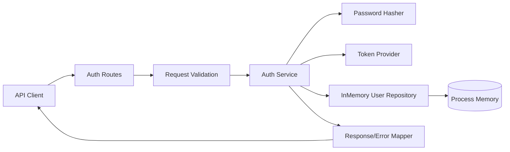
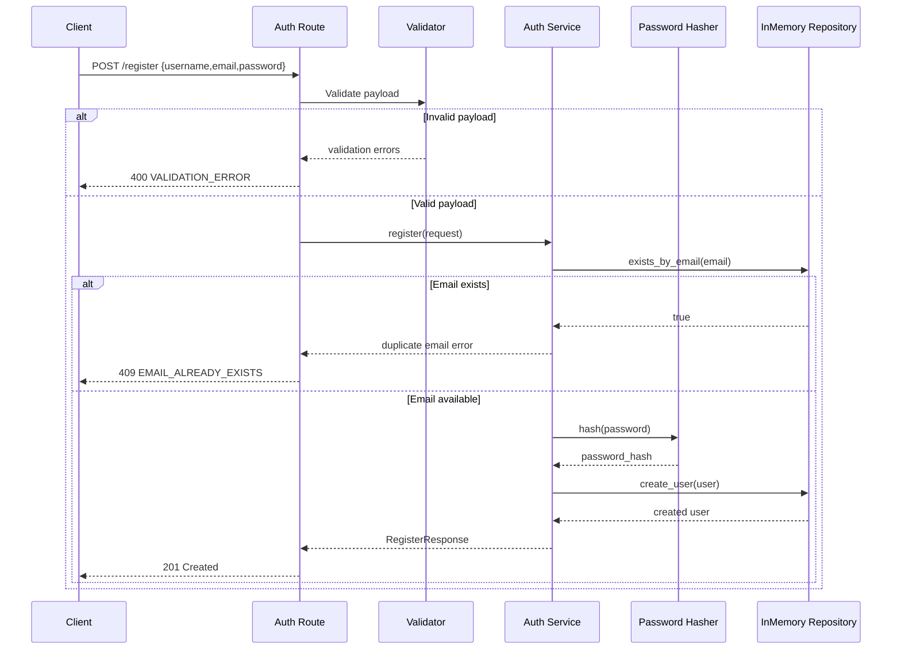
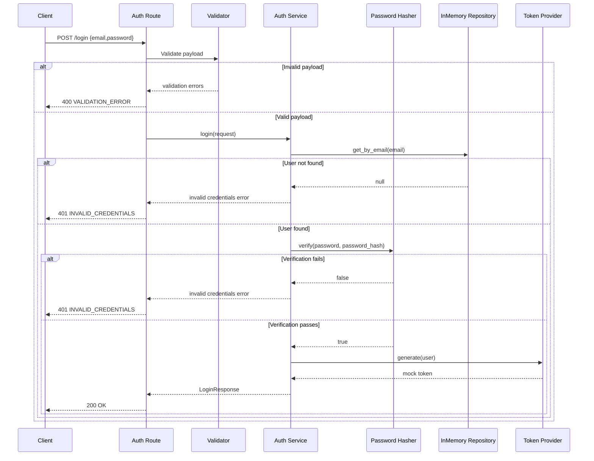

# Architecture Document: SCRUM-10

## Overview

SCRUM-10 introduces a minimal authentication slice for user onboarding with two REST endpoints: registration and login. The architecture is intentionally lightweight and test-first: API routes perform schema and business validation, delegate secure credential handling to a service layer, and use an in-memory repository for user state during process lifetime only. This satisfies current story scope while preserving a clear upgrade path to persistent storage and production-grade token signing.

## Goals and scope

- Deliver `POST /register` and `POST /login` with deterministic JSON responses.
- Enforce baseline input validation and consistent error semantics (`400`, `401`, `409`).
- Never store, log, or return plain text passwords.
- Keep data in-memory only for this story (resets on restart).
- Prepare clean extension points for JWT and persistent repository migration.

In scope:
- Registration and login behavior only.

Out of scope:
- Profile endpoints, password reset, email verification.
- Logout, token revocation, refresh tokens.
- Durable storage and production key management.

## High-level component diagram



## Key components and their responsibilities

- Auth Routes
  - Expose `POST /register` and `POST /login`.
  - Parse request body and map domain exceptions to HTTP responses.

- Request Validation
  - Enforce required/non-empty fields and payload shape.
  - Enforce email format and minimum password policy.

- Auth Service
  - Coordinate registration and login workflows.
  - Apply duplicate-email checks and credential verification.

- Password Hasher
  - Hash passwords before persistence.
  - Verify plaintext login input against stored hash.

- Token Provider
  - Return temporary mock token for successful login.
  - Isolate token logic behind an interface for JWT migration.

- InMemory User Repository
  - Store users keyed by normalized email in process memory.
  - Provide deterministic lookup and duplicate detection.

- Response/Error Mapper
  - Normalize success and error payload shape.

## Technology choices with justification

- Python + FastAPI + Pydantic
  - Aligns with current repository implementation patterns under existing stories.
  - Provides strong request validation and clean test ergonomics.

- Passlib with bcrypt (or equivalent bcrypt-backed strategy)
  - Meets FR-5 and NFR-5 for secure password hashing with salt.
  - Widely used, battle-tested, and simple to adopt in this scope.

- In-memory repository via Python dict
  - Matches FR-9 temporary persistence requirement.
  - Keeps runtime and tests fast, isolated, and dependency-free.

- Pytest + FastAPI TestClient
  - Consistent with existing testing stack and current story structure.

## API contracts

### POST /register

Purpose:
- Create a new user if email is not already registered.

Request JSON:
```json
{
  "username": "alice",
  "email": "alice@example.com",
  "password": "StrongPass123"
}
```

Success response:
- Status: `201 Created`
- Body:
```json
{
  "id": "u_0001",
  "username": "alice",
  "email": "alice@example.com",
  "message": "User registered successfully"
}
```

Error responses:
- `400 Bad Request` for missing/empty/invalid fields.
- `409 Conflict` when email already exists.

### POST /login

Purpose:
- Authenticate existing user credentials.

Request JSON:
```json
{
  "email": "alice@example.com",
  "password": "StrongPass123"
}
```

Success response:
- Status: `200 OK`
- Body:
```json
{
  "token": "mock-token-alice-1721913600",
  "token_type": "Bearer"
}
```

Error responses:
- `400 Bad Request` for malformed request.
- `401 Unauthorized` for invalid credentials.

## Request/response/error models

Request models:
- RegisterRequest: `username: str`, `email: str`, `password: str`
- LoginRequest: `email: str`, `password: str`

Response models:
- RegisterResponse: `id`, `username`, `email`, `message`
- LoginResponse: `token`, `token_type`

Error model (shared):
```json
{
  "error": {
    "code": "VALIDATION_ERROR",
    "message": "email is required",
    "details": [
      {
        "field": "email",
        "reason": "missing"
      }
    ]
  }
}
```

Error code mapping:
- `400`: `VALIDATION_ERROR`
- `401`: `INVALID_CREDENTIALS`
- `409`: `EMAIL_ALREADY_EXISTS`

## Validation rules

- Common
  - Content type must be JSON.
  - Required fields must be present and non-empty after trim.

- Registration
  - `username`: non-empty string, length 3-50.
  - `email`: valid email format; normalized to lowercase for uniqueness checks.
  - `password`: non-empty string, minimum length 8.

- Login
  - `email`: required, valid format.
  - `password`: required, non-empty.

- Invalid input behavior
  - Return deterministic `400` payload with stable error code and field details.

## Password hashing strategy

- Use bcrypt-backed hashing with per-password random salt.
- Persist only hashed value and hash metadata string (never plaintext).
- Verification flow:
  - On login, compare submitted password with stored hash via verifier.
- Security controls:
  - Do not log password fields.
  - Do not include password hash in API responses.
  - Keep hasher behind interface for future parameter tuning.

## In-memory data model and repository design

User entity:
- `id: str`
- `username: str`
- `email: str` (normalized lowercase)
- `password_hash: str`
- `created_at: datetime`

Repository contract:
- `create_user(user: User) -> User`
- `get_by_email(email: str) -> User | None`
- `exists_by_email(email: str) -> bool`
- `clear() -> None` (test support)

Storage structure:
- Primary index: dict keyed by normalized email.
- Optional secondary key: generated user id for future expansion.

Concurrency note:
- Current single-process in-memory approach is acceptable for story scope.
- If concurrency concerns emerge, add lock abstraction or replace repository.

## Token generation approach (temporary with upgrade path)

Current temporary behavior:
- Return deterministic mock token string for successful login.
- Example format: `mock-token-<username>-<unix_ts>`.

Abstraction:
- `TokenProvider.generate(user: User) -> str`

Upgrade path:
- Replace mock provider with JWT provider without route/service signature changes.
- Planned JWT fields: `sub` (user id), `email`, `iat`, `exp`.
- Signing secret to come from environment variable in follow-up story.

## Sequence flows

### Registration flow



### Login flow



## Test strategy

Coverage goals:
- Endpoint behavior per requirement and status code.
- Deterministic error payload shapes.
- Service-level duplicate and credential logic.
- Repository isolation and reset behavior.
- Password hashing non-plaintext guarantees.

Planned test groups under `tests/SCRUM_10`:
- `test_register_api.py`
  - success registration (`201`)
  - duplicate email (`409`)
  - missing/invalid fields (`400`)
- `test_login_api.py`
  - success login returns token (`200`)
  - invalid password/email (`401`)
  - malformed payload (`400`)
- `test_auth_service.py`
  - registration hashing and duplicate checks
  - login verification logic
- `test_repository_isolation.py`
  - in-memory reset between tests
- `test_error_models.py`
  - deterministic error schema for `400`, `401`, `409`

## Security and compliance notes

- Passwords are never stored, logged, or returned in plaintext.
- Password hashes are treated as sensitive and excluded from response serialization.
- Error responses avoid disclosing whether email or password was specifically wrong in login (`401 INVALID_CREDENTIALS`).
- No secrets are committed; current token is mock by design.
- Architecture preserves clear seam for environment-based secret injection in follow-up JWT implementation.

## Risks and non-goals

Risks:
- In-memory storage loses users on restart (accepted by FR-9).
- Mock token cannot provide real auth guarantees.
- Single-process memory model is not horizontally scalable.

Non-goals:
- Session management, refresh/revocation, and logout.
- Multi-factor auth and account recovery.
- Production key rotation and token introspection.

## Implementation-ready folder plan

Story-scoped source plan (`SCRUM_10` is Python-safe naming):

- `src/SCRUM_10/__init__.py`
- `src/SCRUM_10/main.py`
- `src/SCRUM_10/models/__init__.py`
- `src/SCRUM_10/models/user.py`
- `src/SCRUM_10/routes/__init__.py`
- `src/SCRUM_10/routes/auth.py`
- `src/SCRUM_10/services/__init__.py`
- `src/SCRUM_10/services/auth_service.py`
- `src/SCRUM_10/security/__init__.py`
- `src/SCRUM_10/security/password_hasher.py`
- `src/SCRUM_10/security/token_provider.py`
- `src/SCRUM_10/store/__init__.py`
- `src/SCRUM_10/store/in_memory_user_repo.py`
- `src/SCRUM_10/schemas/__init__.py`
- `src/SCRUM_10/schemas/auth.py`
- `src/SCRUM_10/errors.py`

Story-scoped test plan:

- `tests/SCRUM_10/__init__.py`
- `tests/SCRUM_10/conftest.py`
- `tests/SCRUM_10/test_register_api.py`
- `tests/SCRUM_10/test_login_api.py`
- `tests/SCRUM_10/test_auth_service.py`
- `tests/SCRUM_10/test_repository_isolation.py`
- `tests/SCRUM_10/test_error_models.py`
