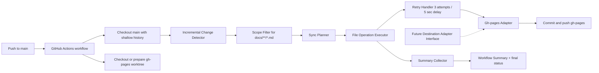

# Architecture for SCRUM-6

## Overview
This architecture implements an incremental Markdown sync pipeline that publishes `docs/**/*.md` from `main` to `gh-pages` using GitHub Actions on `ubuntu-latest` and authentication via `GITHUB_TOKEN` only.

The design is intentionally narrow: only Markdown files under `docs/` are published, excluded folders are never scanned or synced, and each eligible file change is handled incrementally without a full rebuild. Transient per-file failures are retried up to three times with a five-second delay between retries, while the workflow continues processing all remaining eligible files and fails only at the end if any file still failed.

## High-Level Component Diagram

## Technology Choices and Justification
- GitHub Actions on `ubuntu-latest`
  - Satisfies the repository-as-code requirement and provides a consistent runner environment.
- Python 3 for the sync engine
  - Provides strong path handling, deterministic file filtering, and simple retry/summary logic.
- Native `git` commands
  - Best fit for computing incremental file deltas and updating `gh-pages` efficiently.
- `GITHUB_TOKEN`
  - Meets the security requirement without additional secrets.
- GitHub Pages branch publishing (`gh-pages`)
  - Aligns exactly with the requested publish target.

## Data Flow
1. A push to `main` triggers the workflow.
2. The workflow checks out the source repository and prepares a writable `gh-pages` worktree or branch state.
3. The change detector computes the incremental delta from the previous publish state, including added, modified, renamed, and deleted files.
4. The scope filter keeps only `docs/**/*.md` and excludes `.sdlc/`, `node_modules/`, `.github/`, and `venv/`.
5. The sync planner maps source paths to destination paths while preserving the `docs/` folder structure exactly.
6. The file executor applies copy/update/delete operations one file at a time.
7. For each eligible file operation, the retry handler retries transient failures up to three times with a five-second wait between attempts.
8. The workflow continues until all eligible files have been attempted.
9. The summary collector records successful files, failed files, and deleted files.
10. The publisher commits and pushes the `gh-pages` branch if there are changes.
11. The workflow fails at the end if any file still failed after retries.

## Key Components and Responsibilities

### Workflow Trigger
- Starts on every push to `main`.

### Change Detector
- Uses git diff history to identify only eligible incremental file changes.
- Recognizes added, modified, renamed, and deleted files.
- Does not perform a full rebuild scan.

### Scope Filter
- Includes only `docs/**/*.md`.
- Excludes `.sdlc/`, `node_modules/`, `.github/`, and `venv/`.

### Sync Planner
- Translates source deltas into copy, update, and delete operations.
- Preserves source-relative path structure under `gh-pages`.

### File Operation Executor
- Executes per-file sync actions.
- Runs best-effort processing for all eligible files.

### Retry Handler
- Retries transient per-file failures up to 3 times.
- Waits 5 seconds between retry attempts.
- Treats repeated failures as terminal for that file and reports them in the summary.

### Gh-pages Adapter
- Encapsulates branch preparation, file writes, deletions, commit, and push.
- Is the only active destination adapter in this release.
- Preserves extension points for future publish targets.

### Summary Collector
- Builds a final report containing successful files, failed files, and deleted files.
- Ensures the workflow output is auditable in one run.

### Failure Controller
- Marks the workflow failed only after all eligible files have been attempted.
- Uses the presence of any terminal file failure to determine the final non-zero exit.

## GitHub Actions Workflow Structure
- Job name: `sync-docs-to-gh-pages`
- Runner: `ubuntu-latest`
- Permissions: `contents: write`
- Trigger: `push` on `main`
- Concurrency: one in-flight run per branch to avoid overlapping publishes

### Workflow Steps
1. Check out source code with shallow fetch depth sufficient for incremental diffing.
2. Set up Python 3.
3. Prepare the `gh-pages` worktree or branch state.
4. Run the sync script.
5. Retry transient file failures with the documented retry policy.
6. Write the final summary to the GitHub Actions job summary.
7. Commit and push `gh-pages` if changes exist.
8. Exit with failure if any eligible file failed after retries.

## Requirements Traceability Matrix

| Requirement | Architectural coverage |
| --- | --- |
| FR-1 | Workflow trigger on push to `main` |
| FR-2 | Scope filter for `docs/**/*.md` |
| FR-3 | Exclusion rules for `.sdlc/`, `node_modules/`, `.github/`, and `venv/` |
| FR-4 | `gh-pages` destination adapter and branch publish step |
| FR-5 | Path mapping preserves `docs/` folder structure |
| FR-6 | Incremental change detector and sync planner |
| FR-7 | Retry handler with 3 attempts and 5-second delay |
| FR-8 | Best-effort executor that continues after per-file failures |
| FR-9 | Summary collector producing success/failure/deletion lists |
| FR-10 | Failure controller that fails after all eligible files are attempted |
| FR-11 | Delete operation in sync planner and adapter |
| FR-12 | `GITHUB_TOKEN`-only authentication |
| NFR-1 | No external secrets or alternate credentials |
| NFR-2 | Bounded retries plus end-of-run aggregate reporting |
| NFR-3 | Auditable workflow summary in a single run |
| NFR-4 | Workflow-as-code in GitHub Actions |
| NFR-5 | Incremental-only delta processing |

## Reliability and Scalability Considerations
- The workflow remains incremental by design, so runtime scales with changed files rather than repository size.
- Because only `docs/**/*.md` is in scope, processing remains bounded and predictable.
- The retry policy is limited to transient per-file failures so the workflow remains resilient without masking persistent problems.
- The summary is produced after all eligible files are attempted, ensuring a complete operational picture.
- The concurrency policy prevents overlapping publish runs from racing against each other.

## Security and Compliance
- Uses only `GITHUB_TOKEN`.
- Uses `contents: write` only for publishing to `gh-pages`.
- Avoids PATs, deploy keys, and external secrets entirely.
- Never publishes `.sdlc/` or other excluded internal artifact folders.

## Extension Points
- The destination adapter interface is kept explicit so future targets can be added without rewriting the incremental change detector or scope filter.
- Additional publish destinations can reuse the same planner, retry handler, and summary collector.
