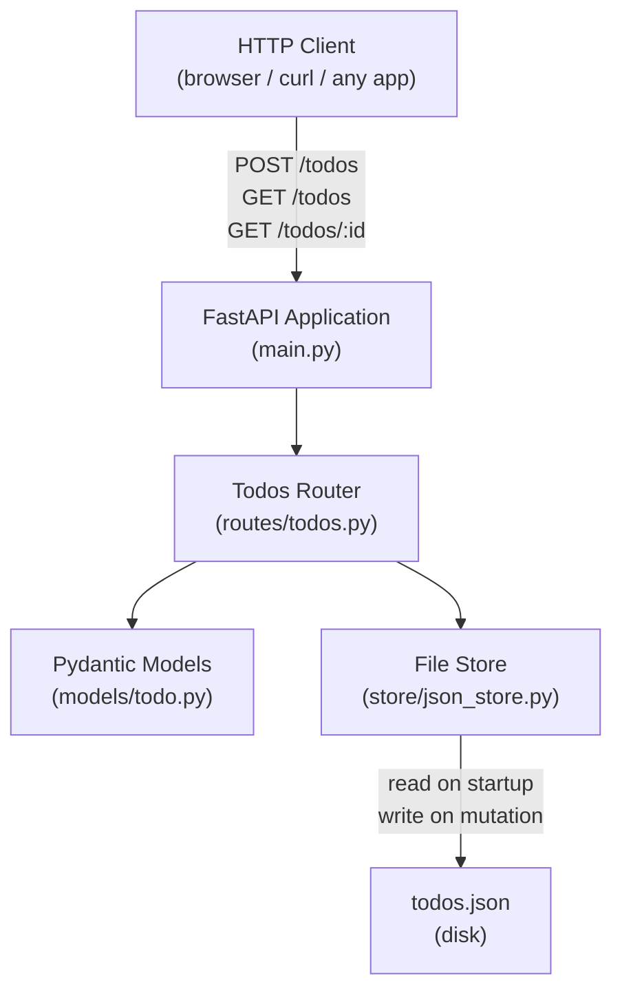
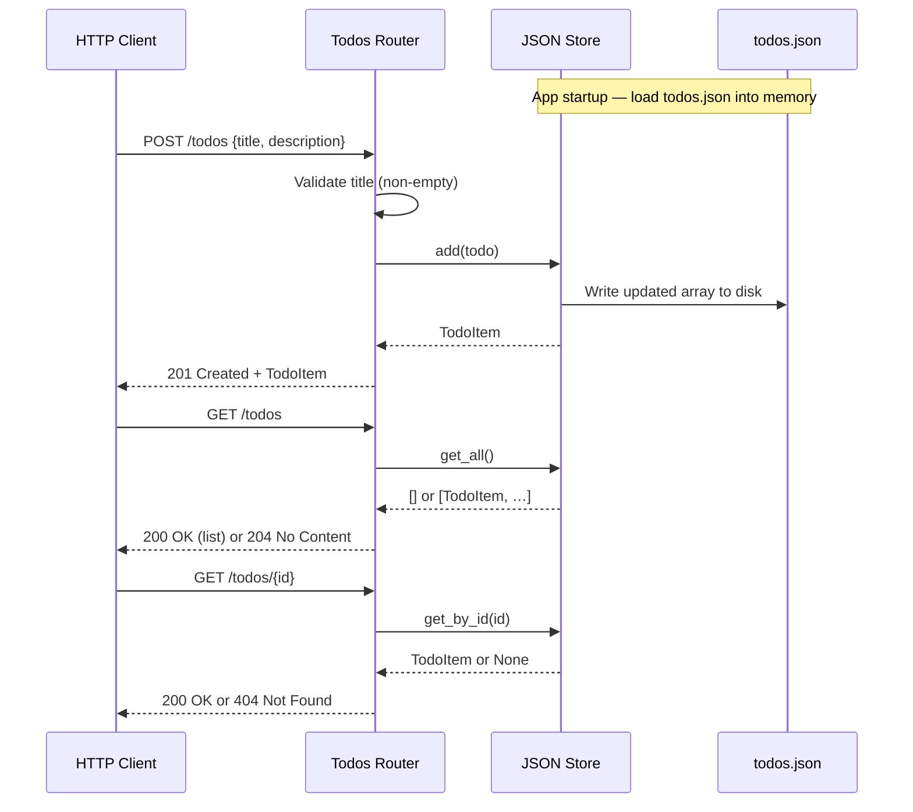

# Architecture: SCRUM-8 — Add and View Personal To-Do Items via a REST API

## Overview

This story delivers a lightweight REST API built with **Python and FastAPI** that allows any HTTP client to create and retrieve to-do items. Items are persisted to a local JSON file, which is loaded into memory at startup and flushed to disk on every write, providing durability without the overhead of a database. There is no authentication layer; all clients share a single global list.

---

## High-Level Component Diagram



---

## Key Components and Their Responsibilities

| Component | File | Responsibility |
|-----------|------|----------------|
| **FastAPI App** | `main.py` | Initialises the application, loads the JSON store at startup, mounts the router. |
| **Todos Router** | `routes/todos.py` | Defines the three endpoints (`POST /todos`, `GET /todos`, `GET /todos/:id`), validates input, delegates to the store, and returns correct HTTP status codes. |
| **Pydantic Models** | `models/todo.py` | Declares `TodoCreate` (request body) and `TodoItem` (response schema) with field types and defaults. |
| **JSON File Store** | `store/json_store.py` | Reads `todos.json` into an in-memory list at startup; exposes `get_all()`, `get_by_id()`, and `add()` methods; writes back to disk after every mutation. |
| **todos.json** | `todos.json` | Flat JSON array on disk acting as the persistent data store. |
| **requirements.txt** | `requirements.txt` | Pins `fastapi`, `uvicorn[standard]`, and any other runtime dependencies. |

---

## Technology Choices with Justification

| Technology | Choice | Justification |
|------------|--------|---------------|
| Language | Python 3.11+ | Specified by NFR-1; widely available, rapid development. |
| Framework | FastAPI | Specified by NFR-1; automatic OpenAPI docs, built-in Pydantic validation, async-capable. |
| ASGI Server | Uvicorn | Standard pairing with FastAPI; minimal overhead. |
| Data Validation | Pydantic v2 (bundled with FastAPI) | Handles request body validation (FR-8) and response serialisation (FR-9) automatically. |
| Persistence | JSON file on disk | Specified by requirements; no infrastructure dependencies; suitable for MVP scale. |

---

## API Design

### Endpoints

| Method | Path | Request Body | Success Response | Error Responses |
|--------|------|-------------|-----------------|-----------------|
| `POST` | `/todos` | `{ "title": string (required), "description": string (optional) }` | `201 Created` — full `TodoItem` | `400` if `title` missing/empty |
| `GET` | `/todos` | — | `200 OK` — array of `TodoItem` | `204 No Content` if list is empty |
| `GET` | `/todos/{id}` | — | `200 OK` — single `TodoItem` | `404 Not Found` if id unknown |

### TodoItem Schema

```json
{
  "id": 1750000000000,
  "title": "Buy groceries",
  "description": "Milk, eggs, bread",
  "done": false,
  "createdAt": "2026-06-23T10:00:00.000Z"
}
```

- `id` — milliseconds since Unix epoch at creation time (int).
- `done` — always `false` at creation (update endpoint is out of scope).
- `createdAt` — ISO 8601 UTC timestamp.

---

## Data Flow Diagram



---

## Security and Compliance Notes

- **Input validation:** FastAPI/Pydantic enforces type safety; `title` is validated as non-empty before any write, preventing blank records (FR-8).
- **No authentication:** Out of scope per requirements; the API must not be exposed to the public internet in this state — deploy behind a firewall or localhost only.
- **No path traversal risk:** The JSON file path is a fixed constant in the store module; no user-supplied paths are used.
- **No secrets in code:** No credentials, tokens, or sensitive values are present.

---

## Extension Points for Future Growth

- **Authentication:** Add OAuth2/JWT middleware in `main.py` without changing the router or store.
- **Database migration:** Replace `json_store.py` with a SQLAlchemy/async repository behind the same interface; no router changes needed.
- **Additional endpoints:** `PUT /todos/{id}` and `DELETE /todos/{id}` can be added to the existing router cleanly.
- **Pagination:** `GET /todos` can accept `?skip=` and `?limit=` query params with minimal router changes.
