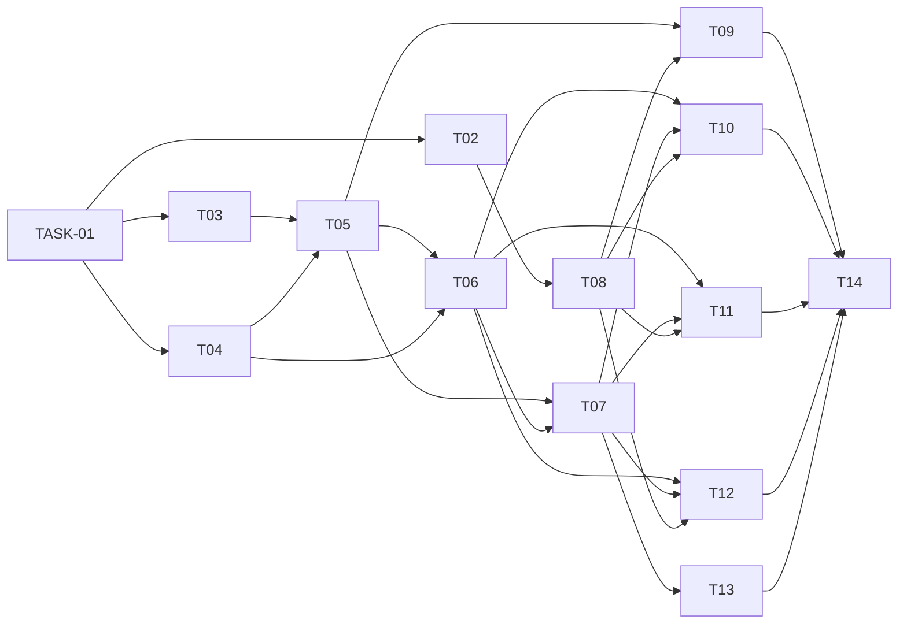

# Implementation Plan: SCRUM-8 — Add and View Personal To-Do Items via a REST API

**Branch:** `feature/scrum-8`
**Date:** 2026-06-23
**Status:** Ready for implementation

---

## Phase 1: Setup

| Task ID | Title | Description | Depends On | Blocked | Effort |
|---------|-------|-------------|------------|---------|--------|
| TASK-01 | Initialise project structure | Create the top-level project folder with sub-directories: `routes/`, `models/`, `store/`. Add empty `__init__.py` files in each package directory. | None | No | S |
| TASK-02 | Create `requirements.txt` | Pin dependencies: `fastapi>=0.111`, `uvicorn[standard]>=0.29`. No other runtime deps required. Satisfies NFR-4. | TASK-01 | No | S |
| TASK-03 | Create `todos.json` seed file | Create an empty JSON array `[]` at `todos.json` in the project root so the store has a valid file to read on first startup. | TASK-01 | No | S |

---

## Phase 2: Core

| Task ID | Title | Description | Depends On | Blocked | Effort |
|---------|-------|-------------|------------|---------|--------|
| TASK-04 | Implement Pydantic models (`models/todo.py`) | Define `TodoCreate` with fields `title: str` (min length 1) and `description: Optional[str] = None`. Define `TodoItem` with all fields: `id: int`, `title: str`, `description: Optional[str]`, `done: bool = False`, `createdAt: datetime`. `done` is excluded from `TodoCreate`. Satisfies FR-7, FR-8 (validation), FR-9 (serialisation). | TASK-01 | No | S |
| TASK-05 | Implement JSON file store (`store/json_store.py`) | Implement `JsonStore` class with: (1) `load()` — reads `todos.json` into `self._items: list[dict]` at startup; (2) `get_all() → list[dict]`; (3) `get_by_id(id: int) → dict or None`; (4) `add(todo: dict) → dict` — generates timestamp ID (ms epoch), increments on collision (GAP-3), sets `done=False`, `createdAt` as ISO UTC string, appends and flushes to disk; (5) `asyncio.Lock()` wrapping all read-modify-write in `add()` (GAP-2). Satisfies FR-2, FR-7, FR-10, NFR-2. | TASK-03, TASK-04 | No | M |
| TASK-06 | Implement todos router (`routes/todos.py`) | Define an `APIRouter` with three routes: (1) `POST /todos` — validates `TodoCreate`, calls `store.add()`, returns `TodoItem` with `status_code=201`; (2) `GET /todos` — calls `store.get_all()`, returns list or `[]` with `200` (GAP-1 resolution); (3) `GET /todos/{id}` — calls `store.get_by_id()`, returns `TodoItem` or raises `HTTPException(404)`. Satisfies FR-1 through FR-9. | TASK-04, TASK-05 | No | M |
| TASK-07 | Implement FastAPI app entry point (`main.py`) | Create FastAPI app instance. On startup (lifespan event), call `store.load()` to initialise the in-memory list from `todos.json`. Mount the todos router with prefix `/todos`. Satisfies NFR-1, NFR-2. | TASK-05, TASK-06 | No | S |

---

## Phase 3: Testing

| Task ID | Title | Description | Depends On | Blocked | Effort |
|---------|-------|-------------|------------|---------|--------|
| TASK-08 | Add test dependencies (`requirements-dev.txt`) | Add `pytest>=8`, `httpx>=0.27`, `pytest-asyncio>=0.23` to a `requirements-dev.txt`. These are needed for FastAPI's `TestClient` and async test support. | TASK-02 | No | S |
| TASK-09 | Write unit tests for the JSON store | Test `get_all()` on empty store returns `[]`; `add()` returns item with correct fields; `get_by_id()` returns item or `None`; concurrent `add()` calls do not lose items (lock guard). | TASK-05, TASK-08 | No | M |
| TASK-10 | Write integration tests for `POST /todos` | Test: (1) valid body returns `201` + full `TodoItem`; (2) missing `title` returns `400` with `{"detail": ...}`; (3) empty string `title` returns `400`. Satisfies FR-1, FR-2, FR-8. | TASK-06, TASK-07, TASK-08 | No | M |
| TASK-11 | Write integration tests for `GET /todos` | Test: (1) empty store returns `200` with `[]`; (2) after creating items, returns `200` with array of `TodoItem`. Satisfies FR-3, FR-4 (revised), FR-9. | TASK-06, TASK-07, TASK-08 | No | S |
| TASK-12 | Write integration tests for `GET /todos/{id}` | Test: (1) valid id returns `200` + correct `TodoItem`; (2) unknown id returns `404` with `{"detail": ...}`. Satisfies FR-5, FR-6. | TASK-06, TASK-07, TASK-08 | No | S |

---

## Phase 4: Release

| Task ID | Title | Description | Depends On | Blocked | Effort |
|---------|-------|-------------|------------|---------|--------|
| TASK-13 | Write `README.md` | Document: how to install dependencies (`pip install -r requirements.txt`), how to run the server (`uvicorn main:app --reload`), all three API endpoints with example `curl` commands, the `todos.json` persistence note, and the localhost-only deployment warning from the design review. | TASK-07 | No | S |
| TASK-14 | Final checks and PR | Verify all tests pass (`pytest`). Confirm `todos.json` is listed in `.gitignore` (runtime data file). Open a pull request from `feature/scrum-8` → `main` referencing SCRUM-8. | TASK-09, TASK-10, TASK-11, TASK-12, TASK-13 | No | S |

---

## Dependency Order Summary

---

## Effort Summary

| Phase | Tasks | Total Effort |
|-------|-------|-------------|
| Phase 1: Setup | TASK-01, 02, 03 | S + S + S = ~1 hr |
| Phase 2: Core | TASK-04, 05, 06, 07 | S + M + M + S = ~4 hrs |
| Phase 3: Testing | TASK-08, 09, 10, 11, 12 | S + M + M + S + S = ~4 hrs |
| Phase 4: Release | TASK-13, 14 | S + S = ~1 hr |
| **Total** | **14 tasks** | **~10 hrs** |
