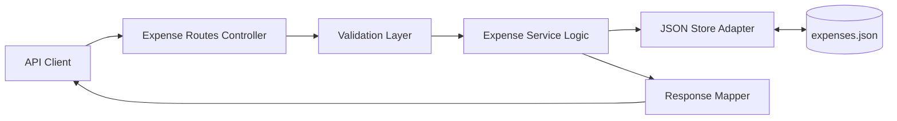
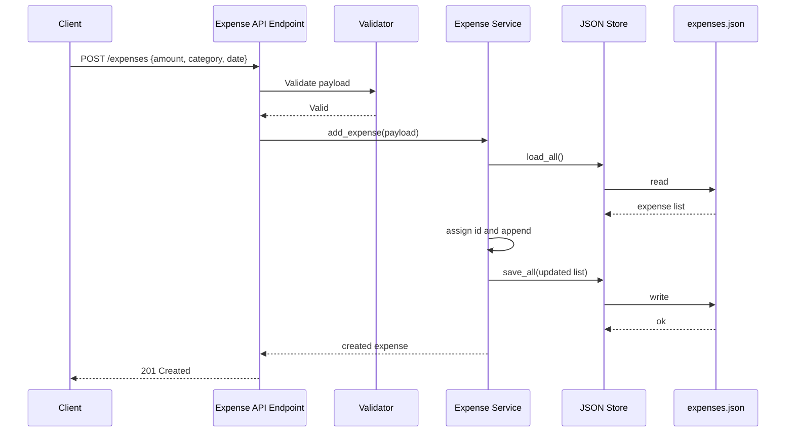

# Architecture Document: SCRUM-9

## Overview

SCRUM-9 delivers a lightweight REST API for personal expense tracking with JSON-file persistence, focused on create and read use cases for an MVP. The design centers on a clear request lifecycle: HTTP endpoints validate inputs, delegate data operations to a storage abstraction, and return normalized JSON responses. The architecture supports listing all expenses, category filtering, and category-level aggregation while keeping implementation simple, testable, and aligned with non-functional constraints (no authentication, single JSON file, strict validation).

## High-level component diagram

## Key components and their responsibilities

- Expense Routes Controller
  - Exposes REST endpoints for create and read operations.
  - Parses query parameters for category filtering.
  - Maps domain/service exceptions to HTTP status codes.

- Validation Layer
  - Validates required fields: amount, category, date for create requests.
  - Enforces type/format checks and rejects invalid payloads with 400 responses.
  - Enforces domain constraints: amount must be positive and category must be non-empty.
  - Enforces date format policy (ISO-8601 date string: YYYY-MM-DD).

- Expense Service Logic
  - Coordinates business operations:
    - Add expense with generated id.
    - Retrieve all expenses.
    - Retrieve expenses filtered by category.
    - Compute category summary totals.
  - Keeps route handlers thin and reusable.
  - Uses decimal-safe amount handling for aggregation correctness.

- JSON Store Adapter
  - Provides read/write operations against a single JSON file.
  - Ensures atomic-style write flow (load -> mutate -> save) for consistency in MVP scope.

- Response Mapper
  - Produces stable JSON response shapes for list and summary endpoints.

## Functional requirements traceability

| Requirement | Architecture component(s) | Notes |
|---|---|---|
| FR-1 Add Expense | Expense Routes Controller, Validation Layer, Expense Service Logic, JSON Store Adapter | POST flow validates payload, assigns id, and persists to JSON |
| FR-2 List All Expenses | Expense Routes Controller, Expense Service Logic, JSON Store Adapter, Response Mapper | GET list reads all records and returns normalized response |
| FR-3 Filter by Category | Expense Routes Controller, Expense Service Logic, Response Mapper | Category query parameter is parsed and applied in service logic |
| FR-4 Category Summary | Expense Routes Controller, Expense Service Logic, Response Mapper | Dedicated summary endpoint computes totals by category |
| FR-5 Data Persistence | JSON Store Adapter, expenses.json | Store abstraction handles durable file read/write |

## Technology choices with justification

- Python + FastAPI (inferred from existing repository structure)
  - Fast endpoint development, strong validation ergonomics, and straightforward testing.

- JSON file storage
  - Explicitly required by NFR-2 and suitable for low-scale MVP without DB overhead.

- Pytest-based tests
  - Matches existing testing stack and supports fast verification of endpoint behavior and store logic.

## Data flow diagram

## API or integration design

- POST /expenses
  - Purpose: Create a new expense.
  - Request body: amount, category, date.
  - Responses:
    - 201 Created with created expense (id, amount, category, date).
    - 400 Bad Request for invalid/missing fields.

- GET /expenses
  - Purpose: Return all expenses.
  - Optional query: category to filter by category.
  - Responses:
    - 200 OK with list of expenses.

- GET /expenses/summary/categories
  - Purpose: Return aggregated total spend per category.
  - Responses:
    - 200 OK with object/map of category -> total amount.

## Deployment and infrastructure design

- Runtime model
  - Single-process API service for local/dev execution.
  - File-based persistence via path-configured expenses.json.

- Environment expectations
  - Writable filesystem in runtime environment.
  - No external infrastructure dependency (database/cache/message bus).

- Operational notes
  - For production hardening later, migrate storage to transactional DB and introduce concurrency-safe persistence.

## Security and compliance notes

- No authentication is intentionally accepted for MVP as defined by NFR-1.
- Validate and sanitize all incoming JSON fields to prevent malformed data ingestion.
- Restrict file-path handling to configured internal storage path to avoid path traversal risks.
- Do not store secrets in code or JSON data files.
- Return clear but non-sensitive validation errors; avoid exposing internal stack traces in API responses.

## Error handling strategy

- Validation failures
  - Return 400 with structured validation details.

- File-not-found behavior
  - If storage file is absent on first run, initialize empty collection and proceed.

- Corrupted JSON handling
  - Treat unreadable JSON as a recoverable server fault and return 500 with generic error message.
  - Log internal parse detail server-side only.

- Write failures
  - Return 500 when persistence write fails; do not return partial success.

- Unknown failures
  - Use global exception handling to return sanitized 500 responses.

## Performance and scalability design

- Current target
  - Low to moderate personal-use traffic with in-memory list operations per request.

- Performance characteristics
  - Read operations are O(n) for list/filter and O(n) for category aggregation.
  - Write operations rewrite the full JSON file; acceptable for MVP data sizes.
  - Amount calculations should use decimal-safe arithmetic to avoid floating-point drift.

- Scalability path
  - Introduce database persistence and indexed queries when data volume or concurrent writes increase.
  - Add pagination to GET /expenses for larger datasets.

## Extension points for future growth

- Domain expansion
  - Add update/delete expense operations without changing storage interface contract.
  - Add date-range filtering and monthly reports in service layer.

- Platform hardening
  - Introduce auth and per-user data partitioning.
  - Replace JSON Store Adapter with DB-backed repository while preserving route/service APIs.

- Integrations
  - Event hooks for notifications or budget alerts after expense creation.