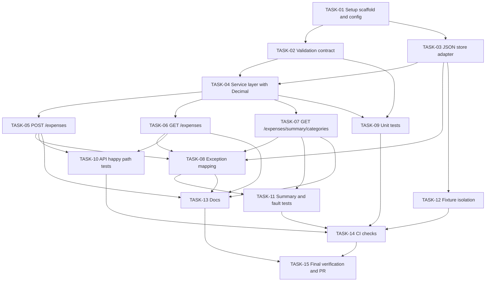

# Implementation Plan: SCRUM-9
Date: 2026-06-23  
Issue Key: SCRUM-9  
Target Branch: feature/scrum-9

## Scope Guardrails
- All story code must live under src/SCRUM_9/ and tests/SCRUM_9/.
- Do not add SCRUM-9 implementation code at repository root.
- Keep architecture-aligned implementation: FastAPI routes, JSON file persistence, strict request validation, decimal-safe amount handling, and explicit error handling.

## Phase 1: Setup

| Task ID | Title | Description | Depends On | Blocked | Effort |
|---|---|---|---|---|---|
| TASK-01 | Create story scaffolding and runtime config | Create and validate story-scoped structure for API package, tests, and docs. Define configurable JSON storage path for SCRUM-9 runtime and tests. Paths: src/SCRUM_9/, tests/SCRUM_9/, docs/SCRUM-9/. Done when app can start with story-local module imports and configurable storage file path. | None | No | S |
| TASK-02 | Define expense schemas and validation contract | Define request/response schemas for expense create/list/summary with strict validation rules: required amount/category/date, positive amount, non-empty trimmed category, date format YYYY-MM-DD. Paths: src/SCRUM_9/models/, src/SCRUM_9/routes/. Done when invalid payloads are deterministically rejected with 400. | TASK-01 | Yes - requires module scaffold from TASK-01 | M |
| TASK-03 | Implement JSON store adapter with fault contracts | Implement load/save abstraction over a single JSON file with first-run initialization (empty list), explicit handling for corrupted JSON, and write-failure propagation. Paths: src/SCRUM_9/store/. Done when adapter behavior is deterministic for missing file, bad JSON, and write errors. | TASK-01 | Yes - requires storage config from TASK-01 | M |

## Phase 2: Core

| Task ID | Title | Description | Depends On | Blocked | Effort |
|---|---|---|---|---|---|
| TASK-04 | Build expense service layer with decimal-safe logic | Implement business operations: add expense (id generation), list all, filter by category, category summary totals using Decimal-safe arithmetic and normalized output conversion. Paths: src/SCRUM_9/services/ and/or src/SCRUM_9/routes/ as per package design. Done when service methods are route-independent and produce stable outputs. | TASK-02, TASK-03 | Yes - requires schema and store behavior | L |
| TASK-05 | Implement POST /expenses endpoint | Add create-expense route in FastAPI that validates payload, delegates to service, returns 201 on success, and maps validation failures to 400. Paths: src/SCRUM_9/routes/, src/SCRUM_9/main.py. Done when endpoint persists expense to JSON store and returns id, amount, category, date. | TASK-04 | Yes - requires service add operation | M |
| TASK-06 | Implement GET /expenses endpoint with category filter | Add list endpoint with optional category query parameter and deterministic filtering semantics. Paths: src/SCRUM_9/routes/, src/SCRUM_9/main.py. Done when unfiltered and filtered responses return 200 with expected lists. | TASK-04 | Yes - requires service list/filter operations | M |
| TASK-07 | Implement GET /expenses/summary/categories endpoint | Add category summary endpoint returning category-to-total mapping based on decimal-safe aggregation. Paths: src/SCRUM_9/routes/, src/SCRUM_9/main.py. Done when totals are precise and stable for decimal values. | TASK-04 | Yes - requires service summary operation | M |
| TASK-08 | Add explicit exception mapping and error response policy | Implement centralized error mapping for validation, persistence, and unexpected failures with sanitized 500 responses and no stack trace leakage. Paths: src/SCRUM_9/main.py, src/SCRUM_9/routes/, src/SCRUM_9/store/. Done when all known fault classes map to defined HTTP responses. | TASK-03, TASK-05, TASK-06, TASK-07 | Yes - requires endpoint and store fault surfaces | M |

## Phase 3: Testing

| Task ID | Title | Description | Depends On | Blocked | Effort |
|---|---|---|---|---|---|
| TASK-09 | Unit tests for validation and service rules | Add unit tests for required fields, date format, positive amount, non-empty category, and Decimal-safe summary behavior. Paths: tests/SCRUM_9/. Done when unit suite covers valid/invalid boundaries and precision cases. | TASK-02, TASK-04 | Yes - requires schema and service logic | M |
| TASK-10 | Integration tests for POST and GET happy paths | Add API tests for create expense, list all, and category filter with JSON persistence assertions. Paths: tests/SCRUM_9/. Done when API behavior matches FR-1, FR-2, FR-3 and persisted state is verified. | TASK-05, TASK-06 | Yes - requires core endpoints | M |
| TASK-11 | Integration tests for summary and error handling | Add API tests for category summary and explicit failure paths: malformed payloads (400), corrupted JSON/read errors (500), write failures (500), missing storage file auto-init behavior. Paths: tests/SCRUM_9/. Done when FR-4 and fault contracts are verified end-to-end. | TASK-07, TASK-08 | Yes - requires summary and exception mapping | L |
| TASK-12 | Test fixtures and isolation strategy | Implement isolated temp-file fixtures to prevent cross-test contamination and ensure deterministic test runs in CI. Paths: tests/SCRUM_9/. Done when tests run independently and repeatably. | TASK-03 | Yes - requires store path abstraction | S |

## Phase 4: Release

| Task ID | Title | Description | Depends On | Blocked | Effort |
|---|---|---|---|---|---|
| TASK-13 | Documentation and usage examples | Document endpoints, validation/error contracts, and example requests/responses. Reinforce story path rules and root-level code prohibition. Paths: docs/SCRUM-9/, src/SCRUM_9/README.md. Done when implementation and docs are consistent. | TASK-05, TASK-06, TASK-07, TASK-08 | Yes - requires finalized API behavior | S |
| TASK-14 | CI checks for SCRUM-9 scope | Add/update workflow checks to run lint/test for SCRUM-9 package and tests. Paths: .github/workflows/SCRUM-9/. Done when CI validates story scope automatically. | TASK-09, TASK-10, TASK-11, TASK-12 | Yes - requires test suite completion | M |
| TASK-15 | Final verification and PR readiness | Perform final runbook: tests pass, error contracts verified, docs updated, CHANGELOG entry prepared, and PR content assembled for feature/scrum-9. Paths: CHANGELOG.md, .sdlc/SCRUM-9/. Done when branch is ready for review with complete evidence. | TASK-13, TASK-14 | Yes - requires docs and CI checks | S |

## Dependency Graph

## Effort Summary

| Effort | Count | Tasks |
|---|---:|---|
| S | 4 | TASK-01, TASK-12, TASK-13, TASK-15 |
| M | 9 | TASK-02, TASK-03, TASK-05, TASK-06, TASK-07, TASK-08, TASK-09, TASK-10, TASK-14 |
| L | 2 | TASK-04, TASK-11 |

## Execution Notes
- Implement in dependency order; do not start blocked tasks early.
- Every task has a testable completion condition and should produce verifiable output.
- Keep all SCRUM-9 code and tests strictly under src/SCRUM_9/ and tests/SCRUM_9/ respectively.
- Avoid adding any SCRUM-9 implementation code at repository root.
