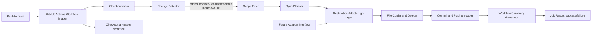

# Architecture for SCRUM-6

## Overview
This architecture implements incremental markdown sync from `main` to `gh-pages` on GitHub-hosted Actions (`ubuntu-latest`) using only `GITHUB_TOKEN`. It is optimized for repositories up to 1 GB and up to 500 markdown files, with a target workflow runtime under 5 minutes.

The initial implementation supports `gh-pages` publishing, while defining extension points for future destinations.

## High-Level Component Diagram

## Technology Choices and Justification
- Runtime: GitHub Actions on `ubuntu-latest`.
- Workflow orchestration: GitHub Actions YAML.
- Sync engine: Python 3 script.
- Git operations: native `git` commands.
- Authentication: built-in `GITHUB_TOKEN` only.

Justification:
- Python provides robust path handling and deterministic filtering logic for incremental sync.
- Native git diffing is the fastest and most reliable way to detect changed/deleted files without full scans.
- `ubuntu-latest` provides predictable execution, fast startup, and standard tooling.
- `GITHUB_TOKEN` satisfies security constraints while enabling branch updates.

## Data Flow: Push to Published GitHub Pages
1. A push event on `main` starts the workflow.
2. The workflow checks out `main` and fetches `gh-pages`.
3. Change Detector computes file deltas from git history (added, modified, renamed, deleted).
4. Scope Filter keeps only markdown files that match:
- root-level `*.md`
- any `*.md` under `docs/`
- excludes `node_modules/`, `.github/`, `venv/`
5. Sync Planner builds operation lists:
- copy/update operations for added/modified/renamed targets
- delete operations for removed source files
6. Destination Adapter (`gh-pages`) maps source paths to mirrored target paths.
7. File executor performs all operations, collecting per-file result status.
8. Branch publisher commits and pushes `gh-pages` updates when there are changes.
9. Summary generator writes a run summary (successes, failures, deletions).
10. Workflow exits with failure if any operation failed, after all operations were attempted.

## Key Components and Responsibilities
- Workflow Trigger
- Starts on push to `main`.

- Checkout Manager
- Retrieves `main` and `gh-pages` content for comparison and publishing.

- Change Detector
- Uses git diff to detect incremental markdown changes only.

- Scope Filter
- Enforces inclusion and exclusion rules for eligible files.

- Sync Planner
- Produces deterministic operation plan for copy/update/delete.

- Destination Adapter Interface
- Defines methods like `map_path()`, `apply_copy()`, `apply_delete()`, `publish()`.
- Current implementation: `GhPagesAdapter`.
- Future implementations can target S3/artifacts/other branches without rewriting core logic.

- Operation Executor
- Executes planned operations and records per-file outcomes.

- Summary Reporter
- Produces a workflow summary table for successful syncs, failures, and deletions.

- Failure Controller
- Marks overall job failed if any file operation fails, but only after all operations complete.

## GitHub Actions Workflow Structure
- Job: `sync-docs-to-gh-pages`
- Runner: `ubuntu-latest`
- Concurrency: single in-flight run per branch using a workflow concurrency group (cancel older in-progress runs on newer pushes).
- Permissions:
- `contents: write` (required for `gh-pages` push)

Steps:
1. `actions/checkout` for `main` with bounded fetch depth (target `fetch-depth: 2`) for incremental diff.
2. Setup Python runtime.
3. Fetch `gh-pages` branch and prepare publish worktree.
4. Run Python sync script:
- collect changed/deleted files
- filter to in-scope markdown
- mirror structure to destination
- apply deletes
- record per-file status
5. Commit/push `gh-pages` if changed.
6. Emit summary to workflow summary output.
7. Exit non-zero if any file operation failed.

Edge-case handling in workflow:
- If `gh-pages` does not exist yet, create an orphan `gh-pages` branch and apply only the in-scope changed markdown operations for that run.
- If previous commit baseline is unavailable (for example, first push or shallow-history edge case), compare `HEAD` with its direct parent when available; otherwise, use the event payload commit range.
- If commit/push to `gh-pages` fails, classify that as a publish-stage failure and include it in the final summary before failing the job.

## Requirements Traceability Matrix

| Requirement | Architectural coverage |
| --- | --- |
| FR-1 | Workflow trigger on push to `main` in workflow structure and data flow step 1. |
| FR-2, FR-3, FR-4 | Scope Filter rules in data flow step 4 and component responsibilities. |
| FR-5, NFR-4 | Incremental git delta detection and bounded operation planning; no full rebuild path. |
| FR-6, FR-7, FR-8 | `GhPagesAdapter` publish target, mirrored path mapping, and delete operations. |
| FR-9, FR-10, FR-11, NFR-2 | Best-effort operation executor, aggregated summary reporter, end-of-run failure controller. |
| FR-12, NFR-1 | `GITHUB_TOKEN` only with `contents: write`; no external secrets. |
| NFR-3 | No-op when no in-scope changes and no effective destination diff. |
| NFR-5 | Workflow-as-code in repository with adapter extension model. |

## Performance and Scalability Design
- Incremental-by-default: no full rebuild path in normal operation.
- Single-pass filtering and planning over changed set.
- Bounded file operations aligned to changed set size, not total repository size.
- Supports repos up to 1 GB and up to 500 markdown files under a 5-minute runtime target by minimizing checkout and copy scope.
- Avoids unnecessary commits when no effective content changes are detected.
- Runtime guardrails: fail fast when runtime exceeds an explicit workflow timeout budget and surface timeout reason in summary.
- Optional optimization: enable sparse checkout paths (`*.md` at root and `docs/**`) when repository layout permits, to reduce checkout and I/O cost.

## Reliability and Failure Model
- Best-effort per-file processing across the full operation set.
- End-of-run aggregated status controls final job state.
- Failures include file-level errors and git publish errors.
- Summary remains available even on failure for fast troubleshooting.

## Security and Compliance
- Uses only `GITHUB_TOKEN`.
- No PATs, deploy keys, or external secrets.
- No external sync services.
- Uses least-privilege workflow permissions with `contents: write` only for publish operations.
